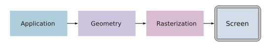
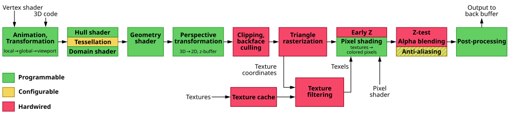
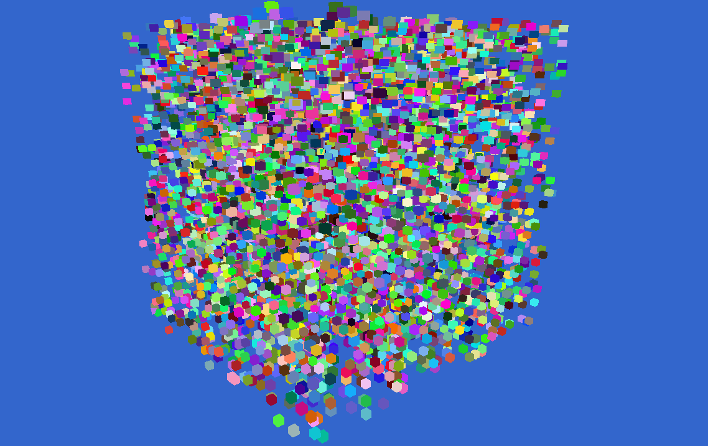
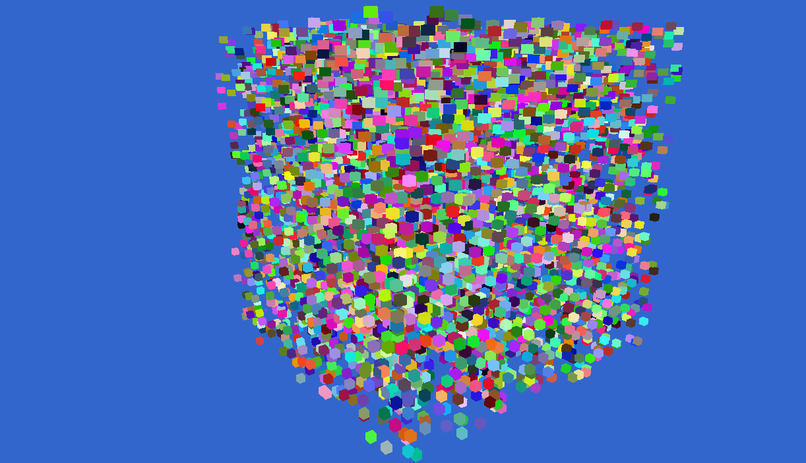
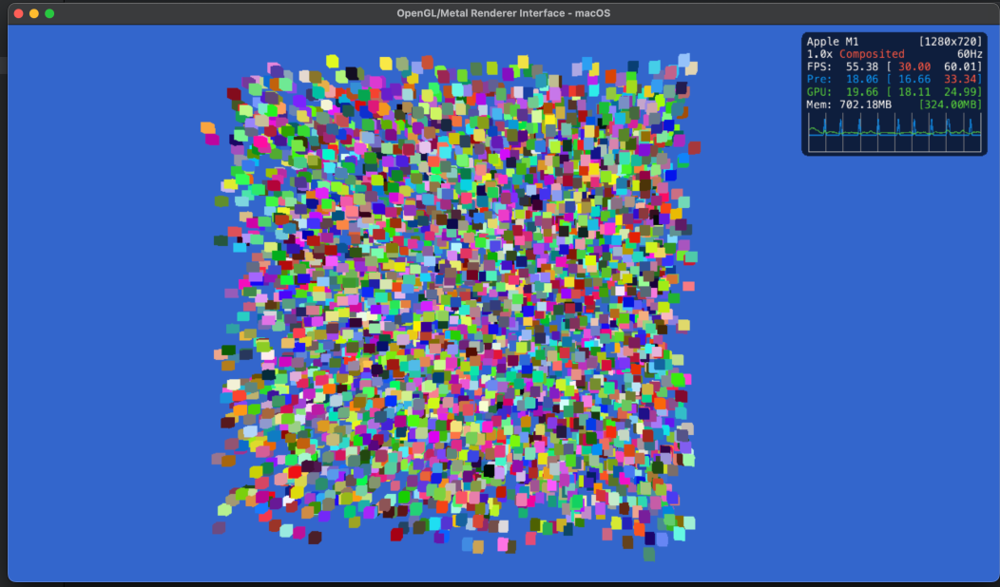

# Do Zero a Um Milhão: Computação Gráfica Moderna com Diferentes APIs

## Introdução

Do primeiro "Hello, World!" (mais conhecido como o primeiro triângulo) em [OpenGL](https://www.opengl.org/) até renderizar 1.000.000 de cubos em Metal, este artigo explora a renderização de 1.000.000 de cubos usando OpenGL e Metal, mostrando como diferentes APIs gráficas impactam performance, controle e complexidade do pipeline.

---

## Computação Gráfica Moderna

Toda renderização segue uma **pipeline gráfica**:



1. **Aplicação (CPU)** → envia vértices e comandos.
2. **Vertex Shader (GPU)** → transforma vértices em espaço de câmera.
3. **Rasterização** → converte triângulos em pixels.
4. **Fragment Shader** → calcula cor e iluminação.
5. **Framebuffer** → produz a imagem final.

A diferença entre APIs está em **como você controla e interage** com esse pipeline — algumas são mais explícitas, outras mais abstratas/automáticas.

---

## Estrutura do Pipeline

A pipeline moderna é composta por múltiplas etapas programáveis:

| Estágio | Descrição |
|----------|------------|
| **Input Assembler** | Lê vértices e índices do buffer. |
| **Vertex Shader** | Transforma posições de modelo para espaço de projeção. |
| **Geometry Shader** | (Opcional) Gera novos vértices ou primitivas, exemplo prático [LOD](https://en.wikipedia.org/wiki/Level_of_detail_(computer_graphics)) |
| **Fragment Shader** | Calcula cor, luz e textura de cada pixel. |
| **Depth/Stencil Test** | Controla visibilidade e hierarquia de camadas, garantindo que objetos mais próximos da câmera sejam renderizados na frente de objetos mais distantes. |




> Fonte: [Wiki Graphics pipeline](https://en.wikipedia.org/wiki/Graphics_pipeline)


---

## Buffers e Recursos

Para que a GPU processe algo, precisamos enviar dados de alguma forma. Isso é feito através de **buffers**.

| Tipo | Descrição |
|-------|------------|
| **Vertex Buffer (VBO)** | Contém vértices (posição, cor, normal, UV). |
| **Index Buffer (IBO)** | Define a ordem dos vértices (triângulos). |
| **Uniform Buffer (UBO)** | Armazena dados uniformes (ex: matrizes, luzes). |
| **Storage Buffer (SSBO)** | Dados grandes e dinâmicos (ex: partículas, instâncias). |
| **Texture** | Armazena imagens, normal maps e UV 1D/2D/3D. |

UV: Coordenadas de textura, mapeiam uma imagem 2D em um modelo 3D.

Exemplo simplificado de envio de vértices em OpenGL:

```cpp
GLuint vbo;
glGenBuffers(1, &vbo);
glBindBuffer(GL_ARRAY_BUFFER, vbo);
glBufferData(GL_ARRAY_BUFFER, sizeof(vertices), vertices, GL_STATIC_DRAW);
```

Em Metal, o mesmo seria:

```objc
id<MTLBuffer> vbuf = [device newBufferWithBytes:vertices
                                         length:sizeof(vertices)
                                        options:MTLResourceStorageModeShared];
```

---

## OpenGL: Máquina de Estados

OpenGL segue um modelo declarativo e global.

> Nas versões modernas (4.X+), foi introduzido o conceito de DSA (Direct State Access), permitindo manipular objetos sem vinculá-los ao contexto atual — reduzindo o acoplamento ao estado global.

### Exemplo: DSA vs Não-DSA

DSA: Direct State Access, permite manipular objetos diretamente sem vinculá-los ao contexto atual.

```cpp
// 4.5+ (com DSA)
glCreateVertexArrays(1, &vao);
glVertexArrayVertexBuffer(vao, 0, vbuf, 0, sizeof(Vertex));

// 3.3 (sem DSA)
glGenVertexArrays(1, &vao);
glBindVertexArray(vao);
glBindBuffer(GL_ARRAY_BUFFER, vbuf);
```

**Vantagens**
- Simples e multiplataforma.
- Ideal para aprendizado e prototipagem rápida.

**Desvantagens**
- Estados globais implícitos.
- Dificuldade em paralelizar.
- Dependência de drivers e implementações de vendors.

---

## Metal: Controle Explícito da GPU

Metal segue um modelo **explícito e orientado a objetos**, semelhante ao Vulkan e DirectX 12.

```objc
id<MTLCommandBuffer> cmd = [queue commandBuffer];
id<MTLRenderCommandEncoder> enc = [cmd renderCommandEncoderWithDescriptor:desc];
[enc setRenderPipelineState:pipeline];
[enc setVertexBuffer:vbuf offset:0 atIndex:0];
[enc drawIndexedPrimitives:MTLPrimitiveTypeTriangle
                indexCount:index_count
                 indexType:MTLIndexTypeUInt16
               indexBuffer:ibuf
         indexBufferOffset:0];
[enc endEncoding];
[cmd presentDrawable:drawable];
[cmd commit];
```

**Vantagens**
- Controle total sobre a pipeline de renderização.
- Performance previsível e eficiente.
- Total integração com o hardware Apple Silicon.

**Desvantagens**
- Verboso e mais complexo.
- Exclusivo do ecossistema Apple.

---

### Complexidade entre diferentes `Backends` 

Embora a computação gráfica seja bastante complexa, ela revela diferentes níveis de controle dependendo da API usada. Por exemplo, **habilitar o depth testing** (teste de profundidade) é algo trivial no OpenGL, mas requer um pouco mais de configuração no Metal.

> **OpenGL**  
> Um simples comando habilita o depth testing, e limpar o buffer de profundidade antes de cada frame é igualmente direto:
```cpp
// Habilita depth testing
glEnable(GL_DEPTH_TEST);

// Antes de iniciar um frame para desenhar, apenas será necessário limpar o Depth Buffer
glClear(GL_COLOR_BUFFER_BIT | GL_DEPTH_BUFFER_BIT);
```

> **Metal**
> Já no Metal, o mesmo efeito envolve definir explicitamente um [MTLDepthStencilState](https://developer.apple.com/documentation/metal/mtldepthstencilstate) e associá-lo ao render encoder, mostrando o nível mais baixo e detalhado de acesso ao hardware:

```objc
// Cria o descriptor do depth state
MTLDepthStencilDescriptor *depthDesc = [[MTLDepthStencilDescriptor alloc] init];
depthDesc.depthCompareFunction = MTLCompareFunctionLess;
depthDesc.depthWriteEnabled = YES;

// Cria o depth state e associa ao encoder
id<MTLDepthStencilState> depthState = [device newDepthStencilStateWithDescriptor:depthDesc];
[renderEncoder setDepthStencilState:depthState];

```
> Sem Depth Test, o resultado visual é incorreto, com objetos mais distantes aparecendo na frente dos mais próximos.
 

> Com Depth Test habilitado, a hierarquia visual é respeitada, e os objetos mais próximos ficam na frente dos mais distantes.



## Shaders e Linguagens

> Shaders são pequenos programas que rodam na GPU, escritos em linguagens específicas para cada API.

As linguagens de shaders variam entre as APIs:

| API | Linguagem | Exemplo (Vertex) |
|------|------------|----------|
| OpenGL | GLSL | `void main()` |
| Metal | MSL | `vertex float4 vertex_main(...)` |
| Vulkan | SPIR-V (intermediário) | Compilado via GLSL/HLSL |
| DirectX | HLSL | `float4 main(...) : SV_Position` |

> Na pasta `res/shaders` contém exemplos de `MSL` e `GLSL` utilizados no projeto.

### Exemplo de Vertex Shader (GLSL)

```glsl
#version 450 core
layout(location = 0) in vec3 a_pos;

uniform mat4 MVP; // Model-View-Projection matrix

void main() {
    gl_Position = MVP * vec4(a_pos, 1.0);
}
```

### Exemplo em MSL

```cpp
vertex float4 vertex_main(const device Vertex* vertices [[buffer(0)]],
                          uint vid [[vertex_id]],
                          constant float4x4& MVP [[buffer(1)]]) {
    return MVP * float4(vertices[vid].position, 1.0);
}
```

---

## Instancing e Batching

Renderizar um milhão de cubos exige técnicas de **batching** e/ou **instancing** — desenhar múltiplas cópias de um mesmo modelo com diferentes transformações.

```cpp
glDrawElementsInstanced(GL_TRIANGLES, indexCount, GL_UNSIGNED_SHORT, 0, instanceCount);
```

Em Metal:

```objc
[enc drawIndexedPrimitives:MTLPrimitiveTypeTriangle
                indexCount:indexCount
                 indexType:MTLIndexTypeUInt16
               indexBuffer:ibuf
         indexBufferOffset:0
             instanceCount:instanceCount];
```
Isso reduz milhões `Draw Calls` para apenas **uma**.

> Imagem Desenhando 1.000.000 de cubos com apenas 1 `Draw Call` em Metal:



Draw Call: Uma chamada para a `GPU` desenhar algo. Muitas chamadas podem ocasionar em `driver overhead`.


Driver Overhead: Latência e perda de performance causada pela comunicação excessiva entre CPU <-> GPU.

---

## Técnicas Avançadas

| Técnica | Descrição |
|----------|------------|
| **[Frustum Culling](https://en.wikipedia.org/wiki/Viewing_frustum)** | Evita renderizar objetos fora do campo de visão da câmera, economizando recursos de processamento.  |
| **Occlusion Culling** | Evita desenhar objetos ocultos por outros. |
| **Depth Pre-Pass** | Primeira passagem apenas para profundidade. |
| **Deferred Shading** | Armazena informações em buffers intermediários (G-buffer). |
| **Compute Shaders** | Usados para cálculos fora da pipeline gráfica tradicional. |
| **Multi-pass Rendering** | Usado em efeitos como sombras, reflexos e pós-processamento. |


---

## Do Zero a Um Milhão

Renderizando 1.000.000 de cubos com **Batching**, **Depth Stencil**, e **Câmera 3D Livre**.

### Estratégias usadas
- Batching em um único buffer.
- Depth + stencil para hierarquia visual.
- Atualização de matrizes no GPU-side.

### Performance

> Hardware usado: MacBook M1 Air 8 GB

| API | FPS Médio | Quantidade de Cubos| Observações |
|-----|------------|------------|--------------|
| OpenGL | ~5 | 1.000.000 | Bound por driver |
| Metal | ~55 | 1.000.000 | Uso total do hardware |


---

## Diferenças Principais

| Conceito | OpenGL | Metal |
|-----------|---------|--------|
| Modelo | Estado global | Controle explícito |
| Command buffers | Implícitos | Manuais |
| Shaders | GLSL | MSL |
| Multiplataforma | Sim | Não |
| Performance | Driver-bound | Próximo ao hardware |
| Paralelismo | Limitado | Nativo |
| Ferramentas | externas (RenderDoc, Nsight) | Integradas (Xcode GPU Frame Debugger) |

---

## Conclusão


OpenGL continua sendo um excelente ponto de partida, mas **Metal e Vulkan** representam o paradigma moderno: **controle total, previsibilidade e performance real**.

> Renderizar triângulos pode parecer algo trivial, mas entender o processo pode ser complexo e recompensador.

---

## Próximos Passos

- Explorar **Vulkan** ou **DirectX 12**.
---

## Repositório & Build

```bash
git clone https://github.com/vsaint1/ogl-metal-renderer
cd ogl-metal-renderer
xmake f -p macosx -m release
xmake build
xmake project -k xcode
```

> OBS: Este projeto pode ser compilado em diversas plataformas


---


## Recursos

### Código Fonte

- [Repositório no GitHub](https://github.com/vsaint1/ogl-metal-renderer)
- [Minha Game Engine (C++)](https://github.com/vsaint1/ember_engine)

### OpenGL
- [OpenGL Documentação (Khronos)](https://www.opengl.org/) – Documentação e notícias oficiais.
- [Learn OpenGL](https://learnopengl.com/) – Tutoriais modernos e exemplos práticos.
- [Docs.gl](https://docs.gl/) – Referência rápida de funções OpenGL e especificações.
- [OGLDEV YouTube](https://www.youtube.com/@OGLDEV) – Canal com tutoriais de OpenGL e computação gráfica no geral.

### Metal
- [Metal Documentação (Apple)](https://developer.apple.com/metal/) – Guia oficial da Apple para Metal.
- [Metal by Example](https://metalbyexample.com/) – Tutoriais e exemplos práticos de Metal com Swift.
- [Metal Tutorial](https://metaltutorial.com/) – Tutoriais e exemplos de Metal com a nova API metal-cpp.

### Matemática

- [3Blue1Brown](https://www.youtube.com/@3blue1brown) – Canal do YouTube com vídeos sobre matemática.


---

## Autor

Vinicius Gabriel — Entusiasta de computação gráfica, matemática aplicada e desenvolvimento de engines e sistemas de jogos em tempo real.

- [Github](https://github.com/vsaint1)
- [LinkedIn](https://www.linkedin.com/in/vsaint1/)
