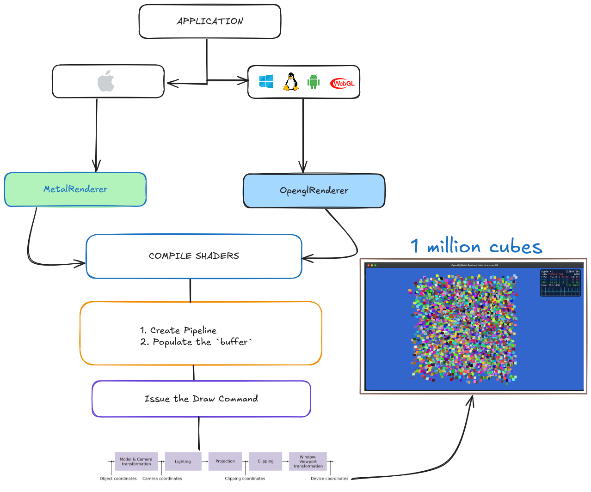

# Do zero a um milhão: Computação Gráfica moderna com diferentes APIs

Olá pessoal! Eu fiz um projeto para brincar com Computação Gráfica (CG), e quero mostrar os primeiros resultados que obtive ao passo que explico alguns ferramentas e conceitos por trás do desenvolvilmento.

O objetivo principal foi sair do primeiro triângulo (podemos dizer que é o equivalente ao "Hello, World!" da CG), até a renderização de 1 milhão de cubos, usando principalmente duas APIs gráficas: [OpenGL](https://www.opengl.org/) e [Metal](https://developer.apple.com/metal/). Ao longo o texto vou mostrar como diferentes APIs gráficas impactam performance, controle e complexidade das etapas de execução da aplicação.

---

TLDR:



## Glossário

- Vértice: São pontos no espaço 2D ou 3D que definem a forma de um objeto.
- Espaço de câmera: É a representação 2D/3D da cena a partir da perspectiva da câmera.
- CPU: Unidade Central de Processamento, responsável por executar instruções e processar dados.
- GPU: Unidade de Processamento Gráfico, especializada em renderização de gráficos e processamento paralelo.
- Driver: Software que permite a comunicação entre o sistema operacional e o hardware físico.
- Vendor: Fabricante do hardware, como NVIDIA, AMD, Intel, Apple.
- Draw Call: Uma chamada para a GPU desenhar algo. Muitas chamadas podem ocasionar em `driver overhead`.
- Driver Overhead: Latência e perda de performance causada pela comunicação excessiva entre CPU <-> GPU.
- Shader: Pequeno programa que roda na GPU para processar vértices ou pixels.
- Framebuffer: Área de memória que armazena a imagem renderizada antes de ser exibida.
- Depth Testing: Técnica que determina a visibilidade dos pixels com base na profundidade.

## Computação Gráfica moderna

Antes de tudo, vamos entender quais são as etapas do processo das quais cosistem a renderização gráfica ou em um termo mais técnico e adequado, a **pipeline gráfica**. São as etapas:


1. **Aplicação (CPU)**: envia vértices e comandos.
2. **Vertex Shader (GPU)**: transforma vértices em espaço de câmera.
3. **Rasterização**: converte triângulos em pixels.
4. **Fragment Shader**: calcula cor e iluminação.
5. **Framebuffer**: produz a imagem final.

Dado esse panorama geral de como funciona a pipeline gráfica, podemos destacar a primeira diferença entre algumas APIs, como OpenGL, abstraem muitos detalhes, enquanto outras, como Metal, Vulkan e DirectX 12 oferecem controle mais direto sobre cada etapa, porém com mais complexidade.

---

## Estrutura da pipeline

A pipeline gráfica moderna é composta por múltiplas etapas programáveis:

- **Input Assembler**: lê vértices e índices do buffer.
- **Vertex Shader**: transforma posições de modelo para espaço de projeção.
- **Geometry Shader (opcional)**: gera novos vértices ou primitivas, exemplo prático [LOD](<https://en.wikipedia.org/wiki/Level_of_detail_(computer_graphics)>)
- **Fragment Shader**: calcula cor, luz e textura de cada pixel.
- **Depth/Stencil Test**: controla visibilidade e hierarquia de camadas, garantindo que objetos mais próximos da câmera sejam renderizados na frente de objetos mais distantes.


> Fonte: [Wiki Graphics pipeline](https://en.wikipedia.org/wiki/Graphics_pipeline)

---

## Buffers e recursos

Para que a GPU processe algo, precisamos enviar dados de alguma forma. Isso é feito através de **buffers**.


| Tipo                      | Descrição                                                      |
| ------------------------- | -------------------------------------------------------------- |
| **Vertex Buffer (VBO)**   | Contém vértices (posição, cor, normal, UV).                    |
| **Index Buffer (IBO)**    | Define a ordem dos vértices (triângulos).                      |
| **Uniform Buffer (UBO)**  | Armazena dados uniformes (ex: matrizes, luzes).                |
| **Storage Buffer (SSBO)** | Dados grandes e dinâmicos (ex: partículas, instâncias).        |
| **Texture**               | Armazena imagens, normal maps e UV 1D/2D/3D.                   |
| **UV**                    | Coordenadas de textura, mapeiam uma imagem 2D em um modelo 3D. |


> Exemplo de uma estrutura de vértice em C/C++


```cpp

struct Vec2 { float x, y; };
struct Vec3 { float x, y, z; };

struct Vertex {
    Vec3 position; // Posição 3D
    Vec3 color;    // Cor RGB
    Vec2 uv;       // Coordenadas de textura
};

```


#### OpenGL (C/C++)

> Exemplo de criação e envio de um Vertex Buffer Object (VBO) em OpenGL
```cpp
GLuint vbo;
glGenBuffers(1, &vbo);
glBindBuffer(GL_ARRAY_BUFFER, vbo);
glBufferData(GL_ARRAY_BUFFER, sizeof(vertices), vertices, GL_STATIC_DRAW);
```

#### Metal (Objective-C++)

> Exemplo de criação e envio de um buffer em Metal
```objc
id<MTLBuffer> vbuf = [device newBufferWithBytes:vertices
                                         length:sizeof(vertices)
                                        options:MTLResourceStorageModeShared];
```

---

Mostrado um pouco das etapas e como é a assinatura de código de cada API, vamos entender quais são as abordagens computacionais usadas por cada uma para executarem as aplicações.

## OpenGL e sua máquina de estados

A OpenGL segue um modelo declarativo e global.

Exemplo: antes de fazer alguma alteração, desenhar algo, ou configurar um estado, é necessário "ativar" ou "vincular" o objeto ao contexto atual.

Exemplo:

> Vincula o VBO atual e todas as operações subsequentes afetarão esse buffer
```cpp
glBindBuffer(GL_ARRAY_BUFFER, vbo); 

```

Nas versões modernas (4.x ou superior), foi introduzido o conceito de Direct State Access (DSA), que consiste em permitir a manipulação de objetos sem vinculá-los ao contexto atual, reduzindo o acoplamento ao estado global.

#### DSA vs Não-DSA (C++)

```cpp
// 4.5+ (com DSA)
glCreateVertexArrays(1, &vao);
glVertexArrayVertexBuffer(vao, 0, vbuf, 0, sizeof(Vertex));

// 3.3 (sem DSA)
glGenVertexArrays(1, &vao);
glBindVertexArray(vao);
glBindBuffer(GL_ARRAY_BUFFER, vbuf);
```

As vantagens dessa abordagem são:

- Simples e multiplataforma.
- Ideal para aprendizado e prototipagem rápida.
- Ampla documentação e disponibilidade de conteúdos.

As desavantagens dessa abordagem são:

- Estados globais implícitos.
- Dificuldade em paralelizar.
- Dependência de drivers e implementações de vendors.
- Última atualização significativa em 2017. (Versão 4.6)

---

## Metal e seu controle explícito da GPU

Metal segue um modelo **explícito e segue um fluxo de comandos**. Cada etapa é controlada diretamente, e o desenvolvedor gerencia buffers, estados e sincronização.

```objc
id<MTLCommandBuffer> cmd = [queue commandBuffer];
id<MTLRenderCommandEncoder> enc = [cmd renderCommandEncoderWithDescriptor:desc];
[enc setRenderPipelineState:pipeline];
[enc setVertexBuffer:vbuf offset:0 atIndex:0];
[enc drawIndexedPrimitives:MTLPrimitiveTypeTriangle
                indexCount:index_count
                 indexType:MTLIndexTypeUInt16
               indexBuffer:ibuf
         indexBufferOffset:0];
[enc endEncoding];
[cmd presentDrawable:drawable];
[cmd commit];
```

**Vantagens**

- Controle total sobre a pipeline de renderização.
- Performance previsível e eficiente.
- Total integração com o hardware Apple Silicon.

**Desvantagens**

- Verboso e mais complexo.
- Exclusivo do ecossistema Apple.
- Pouco conteúdo disponível.
- Conteúdos e/ou Tutoriais implementados em diferentes linguagens (Swift, Objective-C/Objective-C++, C++).

---

## Complexidade entre diferentes backends

Embora a computação gráfica seja bastante complexa, ela revela diferentes níveis de controle dependendo da API usada. Por exemplo, **habilitar o depth testing** (DT) (teste de profundidade) é algo trivial no OpenGL, mas requer um pouco mais de configuração no Metal.

Com a **OpenGL** um simples comando habilita o depth testing, e limpar o buffer de profundidade antes de cada frame é igualmente direto:

```cpp
// Habilita depth testing
glEnable(GL_DEPTH_TEST);

// Antes de iniciar um frame para desenhar, apenas será necessário limpar o Depth Buffer
glClear(GL_COLOR_BUFFER_BIT | GL_DEPTH_BUFFER_BIT);
```

Com a **Metal** o mesmo efeito envolve definir explicitamente um [MTLDepthStencilState](https://developer.apple.com/documentation/metal/mtldepthstencilstate) e associá-lo ao render encoder, mostrando o nível mais baixo e detalhado de acesso ao hardware:

```objc
// Cria o descriptor do depth state
MTLDepthStencilDescriptor *depthDesc = [[MTLDepthStencilDescriptor alloc] init];
depthDesc.depthCompareFunction = MTLCompareFunctionLess;
depthDesc.depthWriteEnabled = YES;

// Cria o depth state e associa ao encoder
id<MTLDepthStencilState> depthState = [device newDepthStencilStateWithDescriptor:depthDesc];
[renderEncoder setDepthStencilState:depthState];

```

Sem Depth Testing, o resultado visual é incorreto, com objetos mais distantes aparecendo na frente dos mais próximos.


Com Depth Testing habilitado, a hierarquia visual é respeitada, e os objetos mais próximos ficam na frente dos mais distantes.


## Shaders e Linguagens

**Shaders** são pequenos programas que rodam na GPU, escritos em linguagens específicas para cada API.

As linguagens de shaders variam entre as APIs:

| API     | Linguagem              | Exemplo (Vertex)                 |
| ------- | ---------------------- | -------------------------------- |
| OpenGL  | GLSL                   | `void main()`                    |
| Metal   | MSL                    | `vertex float4 vertex_main(...)` |
| Vulkan  | SPIR-V (intermediário) | Compilado via GLSL/HLSL          |
| DirectX | HLSL                   | `float4 main(...) : SV_Position` |

### Exemplo de Vertex Shader (GLSL)

```glsl
#version 450 core
layout(location = 0) in vec3 a_pos;

uniform mat4 MVP; // Model-View-Projection matrix

void main() {
    gl_Position = MVP * vec4(a_pos, 1.0);
}
```

### Exemplo em MSL

```cpp
vertex float4 vertex_main(const device Vertex* vertices [[buffer(0)]],
                          uint vid [[vertex_id]],
                          constant float4x4& MVP [[buffer(1)]]) {
    return MVP * float4(vertices[vid].position, 1.0);
}
```

---

## Instancing e Batching

Renderizar um milhão de cubos exige técnicas de **batching** e/ou **instancing** — desenhar múltiplas cópias de um mesmo modelo com diferentes transformações.

```cpp
glDrawElementsInstanced(GL_TRIANGLES, indexCount, GL_UNSIGNED_SHORT, 0, instanceCount);
```

Em Metal:

```objc
[enc drawIndexedPrimitives:MTLPrimitiveTypeTriangle
                indexCount:indexCount
                 indexType:MTLIndexTypeUInt16
               indexBuffer:ibuf
         indexBufferOffset:0
             instanceCount:instanceCount];
```

Isso reduz milhões `Draw Calls` para apenas **uma**.

> Imagem Desenhando 1.000.000 de cubos com apenas 1 `Draw Call` em Metal:
> 


---

## Técnicas Avançadas

| Técnica                                                              | Descrição                                                                                          |
| -------------------------------------------------------------------- | -------------------------------------------------------------------------------------------------- |
| **[Frustum Culling](https://en.wikipedia.org/wiki/Viewing_frustum)** | Evita renderizar objetos fora do campo de visão da câmera, economizando recursos de processamento. |
| **Occlusion Culling**                                                | Evita desenhar objetos ocultos por outros.                                                         |
| **Depth Pre-Pass**                                                   | Primeira passagem apenas para profundidade.                                                        |
| **Deferred Shading**                                                 | Armazena informações em buffers intermediários (G-buffer).                                         |
| **Compute Shaders**                                                  | Usados para cálculos fora da pipeline gráfica tradicional.                                         |
| **Multi-pass Rendering**                                             | Usado em efeitos como sombras, reflexos e pós-processamento.                                       |

---

## Do Zero a Um Milhão

Renderizando 1.000.000 de cubos com **Batching**, **Depth Stencil**, e **Câmera 3D Livre**.

### Estratégias usadas

- Batching em um único buffer.
- Depth + stencil para hierarquia visual.
- Atualização de matrizes no GPU-side.

### Performance

> Hardware usado: MacBook M1 Air 8 GB

| API    | FPS Médio | Quantidade de Cubos | Observações           |
| ------ | --------- | ------------------- | --------------------- |
| OpenGL | ~5        | 1.000.000           | Bound por driver      |
| Metal  | ~55       | 1.000.000           | Uso total do hardware |

---

## Diferenças Principais

| Conceito        | OpenGL                       | Metal                                 |
| --------------- | ---------------------------- | ------------------------------------- |
| Modelo          | Estado global                | Controle explícito                    |
| Command buffers | Implícitos                   | Manuais                               |
| Shaders         | GLSL                         | MSL                                   |
| Multiplataforma | Sim                          | Não                                   |
| Performance     | Driver-bound                 | Próximo ao hardware                   |
| Paralelismo     | Limitado                     | Nativo                                |
| Ferramentas     | externas (RenderDoc, Nsight) | Integradas (Xcode GPU Frame Debugger) |

---

## Conclusão

OpenGL continua sendo um excelente ponto de partida, mas APIs como **Metal**, **Vulkan** e **DirectX 12** oferecem controle e performance superiores para aplicações modernas, que é algo crucial para jogos ou simulações em tempo real.


## Recursos

### Código Fonte

- [Repositório no GitHub](https://github.com/vsaint1/ogl-metal-renderer)
- [Minha Game Engine (C++)](https://github.com/vsaint1/ember_engine)

### OpenGL
- [OpenGL Documentação (Khronos)](https://www.opengl.org/) – Documentação e notícias oficiais.
- [Learn OpenGL](https://learnopengl.com/) – Tutoriais modernos e exemplos práticos.
- [Docs.gl](https://docs.gl/) – Referência rápida de funções OpenGL e especificações.
- [OGLDEV YouTube](https://www.youtube.com/@OGLDEV) – Canal com tutoriais de OpenGL e computação gráfica no geral.

### Metal
- [Metal Documentação (Apple)](https://developer.apple.com/metal/) – Guia oficial da Apple para Metal.
- [Metal by Example](https://metalbyexample.com/) – Tutoriais e exemplos práticos de Metal com Swift.
- [Metal Tutorial](https://metaltutorial.com/) – Tutoriais e exemplos de Metal com a nova API metal-cpp.

### Matemática

- [3Blue1Brown](https://www.youtube.com/@3blue1brown) – Canal do YouTube com vídeos sobre matemática.


---

## Contato

- [Meu Github](https://github.com/vsaint1)
- [Meu LinkedIn](https://www.linkedin.com/in/vsaint1/)


## Créditos

- [Lucas Lima](https://www.linkedin.com/in/lucaslimanunes/) – Revisão e sugestões de melhorias.